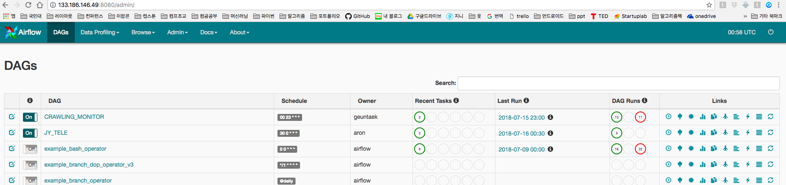
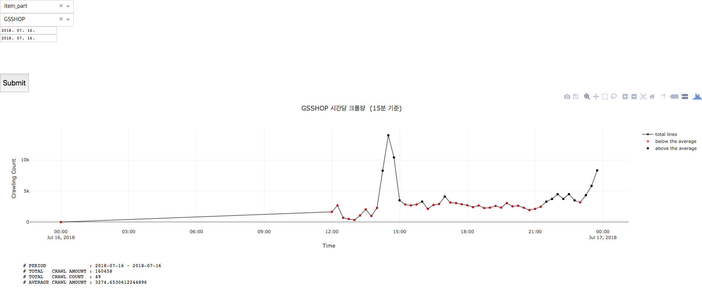

# BI CRAWLING AMOUNT   
  
  
## 사용 URL 링크      
  
http://133.186.159.246:7180

## 사용하는 DB 및 Files 
  
*Write :*  
  
133.186.146.142/eums-poi  (외부 IP : 192.168.0.118) 의 CRALING_AMOUNT    - cm.py  (RDMS)
  
*Read :*  
  
133.186.168.10 의 item_part    - cm.py  (Presto)
  
colt_item_site_list.PQ (RDMS에 있는 각 site 별 ID 정보를 담은 Parquet file)   - BI_crawling_amount_view.py
  
  
## 개발 환경    
  
http://133.186.159.246:9095/lab   (Jupyter Lab)

## 기능  

Presto 에 있는 item_part 를 이용하여 각 사이트별 크롤량을 시각화 해준다.    
평균을 구한 후 평균 미만의 값은 빨간 점으로 표시한다.    
현재 평균이 의미 있는 값이 아니므로 후에 수정해야 한다.  
(어느 순간 크롤이 어떠한 장애를 만나 멈추게 되었는지를 알 수 있는 지표가 필요함)

## 프로세스 :   
  
크롤량을 시각화 해주는 툴을 위해 2개의 모듈로 분리하였다.  
Presto DB에 접근하여 원하는 정보(15분 별 크롤량)로 가공한 후 RDMS에 저장하는 모듈(cm.py)과  
그래프를 그려주는 부분만 담당하는 가벼운 시각화 모듈(BI_crawling_amount_view.py)로 분리하였다.  
전자를 데이터 Sync 모듈, 후자를 시각화 모듈이라고 하였을 시  
데이터 Sync 모듈은 주기적으로 실행되야 하므로 airflow 에 올릴 수 있도록 DAG 로 감싸야한다.  
해당 작업을 위해서 crawler.py 를 사용하였다.  
  
즉, 데이터 Sync 모듈 cm.py 와 시각화 모듈 BI_crawling_amount_view.py 와 이를 DAG 로 감싸는 crawler.py 가 있다.  

## crawler.py    
  
데이터 Sync 모듈을 주기적인 Batch job 을 하기 위해 DAG 를 이용하였다.  
  
  

## cm.py    
  
데이터 Sync 모듈은 RDMS 에 있는 가장 최근 업데이트 날짜를 확인한 후  
가장 최근의 업데이트 날짜 부터 현재 시각까지 Presto 의 데이터를 가져온 후  
15분 마다, 사이트별 크롤량을 계산한 후 RDMS 에 저장한다.  

## BI_crawling_amount_view.py    
  
데이터 시각화 모듈은 각 사이트별 ID 를 알기 위해서 RDMS를 통해 미리 만들어 놓은 colt_item_site_list.PQ 파일을 읽는다.     
그 후 각 사이트별 ID 값을 리스트로 저장한다.  
날짜 범위가 입력되면 그 시간 사이에 일어난 크롤량을 시각화 하여 보여주게 된다.  
  
  

